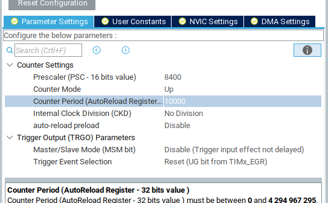

# Project Creation

Open STM32Cube IDE

Choose "New STM32 Project" - you will see the following screen:


In the new product dialog, use the board selector to choose a board.


Default settings are fine for the remainder of the wizard. (C language,
executable project).

*Choose NO for this!*


Do _not_ initialize all peripherals with their default mode.
When the project is created, it will download the firmware (HAL) package for the
product line - this is a large download, but should be taken care of
automatically.

# Configure Peripherals
## ADC
On the pinout configurator (pinout.png), select an appropriate pin to use as an
ADC input. PC0 chosen for this example.


When you click on the pin, you get a list of pin function modes available for
that pin.


The chosen pin is on ADC channel 10, and (in this particular case), there are
three different ADCs available. Because of how the pin mux works, that pin can
be on ADC1, ADC2, or ADC3, but is on channel 10 no matter which ADC peripheral.
This is fairly typical on STM32s. ADC 1 is chosen, semi-arbitrarily.


Review the settings for ADC 1 - the ADC peripheral is fairly simple, without
many configuration options. The "Parameter Settings" tab is of particular
interest, as it sets the ADC resolution and various other parameters.


Other tabs, such as NVIC and DMA settings, can be used to configure interrupts
and direct memory access engine settings, respectively. Most (all?) STM32
peripherals can trigger interrupts upon events, facilitating asynchronous
software design. Furthermore, the DMA engine can be used to handle interrupt
events, for example - reading an ADC sample into a buffer, without having to
interrupt software. We will not do that in this case, and instead utilize a
standard, polled/blocking mode software paradigm for simplicity.

The default settings will work for now, but it is worth looking them over and
referencing the documentation to satisfy any curiosity. The GPIO settings should
reflect the pin chosen using the pinout view.

## Timer
NOTE: Different STM32 MCUs have different timers, and certain timers may have
seemingly weird and arbitrary limitations. Find one that works for your needs.

We will use the TIM2 timer peripheral of this MCU to generate a periodic
interrupt for software. Select TIM1 and enable it by setting the clock source to
"Internal Clock".

The timer has four separate channels. Each channel can be used in typical timer
modes - input capture (stores timer value upon the occurence of an event),
output compare (manipulate a pin when the timer value reaches a particular
count), and more specialized modes. Each mode also generates interrupts as one
might expect. However, there is also an overall "Period Elapsed" interrupt,
which will suffice for our needs. Enable the global interrupt in NVIC settings
to generate this interrupt.


The final parameters to set are the clock parameters of the timer. This can't be
exactly set until final clock values are determined. In this case, though, it is
fairly simple: this timer supports a prescaler (PSC) value and a period. The 
clock input is divided by PSC+1 to generate timer ticks. The clock period is the
number of ticks before clock reset. Other settings may be available, such as
additional clock divisors.

## UART
Each Nucleo has a virtual serial port, which can be used as a general serial
console. The pinout view will have the appropriate pins "pinned" with the UART
RX and TX modes. It is typically UART2 on Nucleos - but you can double check by
clicking on the RX or TX pin and seeing which one is highlighted.


Under "Connectivity", enable the UART by setting it to asynchronous mode.
Default settings should suffice - 115200 8N1. The pinned pins should turn green
in the pinout view, and you can also confirm the pin selection in the GPIO
settings tab.

As with the timer, interrupt and DMA settings are available. This allows the
UART to be used in many powerful modes, such as utilizing DMA to automatically
empty a ring buffer without software intervention. However, we will use slow,
reliable, simple software polling for this project - no interrupts or DMA is
needed.

## Clock Configuration
Honestly, I usually just YOLO this part. But we do need to know what the timer
clock is. On the far right of the clock graph, the bus clocks are listed. Most
(all?) STM32s have two peripheral busses (APB1 and APB2). For most peripherals -
UARTs, SPI, I2C, etc. - the clock used for baud rate generation is the APB
clock. However, timer peripherals use a dedicated timer clock. Technically, to
know the clock rate for TIM2, we would have to look at the user manual to
determine which bus it is on, then look at the timer clock for the right bus.
But both busses are the same - 84 MHz, so we continue on in YOLO mode.


Knowing that the timer (almost certainly) has a clock source of 84 MHz, we can
then go back to the timer settings and get the desired clock period.


With an 84 MHz clock, a prescaler of 8399 (8400 - 1) yields a 10 kHz tick rate.
Note: The 16-bit prescaler limit means that an 84000 prescaler is out of
bounds - 84000 > 65535. So if you want a 1 kHz tick rate, you will have to
adjust clock rates or get creative with built in clock divisors. Configuration
fun!



The timer is now configured to generate a 10 kHz tick with a 10,000 tick period.

## Summary
So far, we have it configured as follows:

- Pin PC0 set as an analog input on ADC1, channel 10.
- ADC1 enabled using channel 10.
- 84 MHz clock supply to timer peripherals
- TIM1 enabled, up-counting at a 10 kHz tick rate to 10,000.
- TIM1 global interrupt enabled, so we can receive a software interrupt when
the period is elapsed.
- USART2 configured as a 115200 8N1 UART.

# Software
The bible: "Description of STM32Cube<Series> HAL and Low-Layer Drivers". It's a
giant PDF with all of the functions for interacting with peripherals. In
particular, the subsection "<Peripheral> Firmware API Description" lists
relevant functions for a particular peripheral. For IO peripherals, the
subsection "IO Operation Functions" lists, obviously, IO functions - including a
description of different blocking and non-blocking (DMA or Interrupt) modes. 

There is also configuration information, such as config structs, which will be 
automatically taken care of -
you can find the generated initialization code in Core/Src/<Peripheral>.c.

## Code Generation
In the Project Manager -> Code Generation tab, set "Generate peripheral
initialization as a pair of .c/.h files per peripheral. This keeps
the code base much more navigable. Review the other project settings, then
generate code from the Eclipse "Project" menu.


Most work now will be done using C files in the normal Eclipse manner - the
device configurator has done its job.

NOTE: The generated code includes comments such as "user code begin 1". Code
between these comments is "safe" and shouldn't be overwritten if the file is
regenerated. Keep these comments in place, only add code in between the blocks,
and everything will be okay. Or, to be extra safe, create a separate file for
the "real" main, and just call that from a safe point in the generated main.c

## Hello World
### HAL UART Transmit
Look in Core/Src/main.c. Between all of the comments and generated
initialization code, there are a few logical points to insert custom code before
(or during) a final infinite loop.

We will use the function HAL\_USART\_Transmit. Because this is blocking, in
addition to a handle, byte buffer, and length, it also takes a timeout argument.
Its usage is self-explanatory:

`HAL_USART_Transmit(&huart2, (uint8_t *) "Hello World\n", 12, 500)`

Sends a Hello World to the console. The only gotcha is the "huart2" device
handle. It is defined in usart.h. HAL functions use peripheral handles to
indicate which device to use.

### Run on hardware
Plug in the nucleo, and choose "Run Project" from the Eclipse menu. It should
detect the ST link and run.

You might get a firmware update notification. This updates the firmware of the
ST-Link programmer onboard the Nucleo and has nothing to do with the target
device that you're actually programming. Just work through the options if it
pops up.


Nothing obvious happens when it runs unless you're watching the serial port.
Point your favorite serial terminal at the virtual serial port, and you should
get a Hello World.

Debugging also more or less just works. It's no different than debugging a local
program in Eclipse. Since the IDE uses the debug interface to load code when
using "run", if it can run, it can debug. If things are broken, just randomly
unplug and/or restart stuff until it starts working.

### Making printf work
Open syscalls.c, and find the \_write syscall stub. The stub
uses a typical one-byte-at-a-time stub with the (not generated) \_\_io\_putchar
function. We can implement that function in main.c, in a protected place so it
doesn't get overwritten, and have libc IO "working". However, the
one-byte-at-a-time approach is redundant with a UART function that can send
entire arrays, so instead redefine the entire \_write stub to something sane:

```
int _write(int file, char *ptr, int len)
{
    if ((file != 1) && (file != 0)) {
        return -EINVAL;
    }

    /* Don't bother error handling in case of timeout */
    HAL_UART_Transmit(&huart2, (uint8_t *) ptr, len, 1000);
    return len;
}
```

Add includes as needed - make sure to put them in a protected block.

At this point, printf and friends should all work!


## Reading the ADC
The ADC driver provides a number of polling and interrupt functions, so software
can be aware of when an ADC read has recently occurred. However, we will keep
things simple using three functions:

- HAL\_ADC\_Start
- HAL\_ADC\_PollForConversion
- HAL\_ADC\_GetValue

The Start function starts the ADC - it will sample the analog input and perform
conversion a single time. PollForConversion will block until the ADC has been
read. Finally, GetValue will return the value. Handling of multiple channels is
not needed.

This application note lists various ADC modes and how to read them:
https://www.st.com/resource/en/application_note/cd00258017-stm32-s-adc-modes-and-their-applications-stmicroelectronics.pdf

## Software Loop and Delay
The HAL\_Delay function can be used in the loop to loop and delay in software.
The process is fairly self explanatory.

## Using a timer callback
The timer peripheral was configured to generate a 1 second periodic interrupt,
so we will use that instead of a software delay. To do so, we first start the
timer using HAL\_TIM\_Base\_Start\_IT. The \_IT version is used because we want
interrupts to be generated by the timer. Then, we define a
HAL\_TIM\_PeriodElapsedCallback function. Our PeriodElapsedCallback will be
called each time the timer completes a cycle. One callback function is shared
between all timers; the timer handle is provided to the callback function to
identify the source of the callback.

# Final Thoughts
This is a simple example, and there are a lot of better ways to do this. Many of
the features we disabled or ignored can be used to simplify or improve
operation, but require a better understanding of the device and of the
peripherals. For example, the timer could be configured as a trigger source for
the ADC directly. A "proper" design would work as follows:

- Timer triggers an ADC sample cycle
- ADC cycle completes and generates an interrupt
- ADC interrupt callback stores the value to a ring buffer
- Software reads the ring buffer and does whatever it does

In particular, this avoids a few of the sins of the current design, mostly
surrounding bad behavior in interrupt context. It is important to note that the
PeriodElapsedCallback occurs in an interrupt context. As such, we are doing a
bunch of naughty things:

- Using printf(). This could cause race conditions or deadlocks in the standard
  library.
- Doing polled IO. Both PollForConversion and HAL\_UART\_Transmit do polling IO,
  which takes an indeterminite amount of time. This is naughty to do in an
  interrupt context.

Furthermore, the ST HAL is not exactly interrupt-safe. The locking mechanism is
buggy and broken. The only reason we get away with this is because we stop doing
anything once the timer (and therefore interrupts) start. Care should be taken
to treat interrupts with respect and only do safe, synchronized operations from
an interrupt context - leave all heavy lifting, polled IO, and standard library
usage to the main execution context.

## Gotchas
Printf can be a memory hog. On memory-constrained devices, it may be best to
avoid using printf and use custom implementations for specific use cases
instead. Additionally, it takes some configuration magic to enable
floating-point printf suppor.

# References/Resources
## HAL reference
As mentioned above, the Description of HAL and Low-Layer Drivers is the bible
for the software side of things. However, there are a few other documents to
straighten out:

The HAL driver description PDF is linked on the product page for the
series-specific firmware package. That isn't usually a page you'll wind up on,
since the IDE (and CubeMX itself) handles downloading of HAL packages. But there
are some useful application notes in the documentation tab as well.

Example (STM32CubeL4 driver description):
https://www.st.com/resource/en/user_manual/dm00173145-description-of-stm32l4l4-hal-and-lowlayer-drivers-stmicroelectronics.pdf

STM32CubeL4 (Firmware package) product page:
https://www.st.com/en/embedded-software/stm32cubel4.html#documentation

## Datasheets
The datasheets are actually not particularly useful for development - most of 
the specifics for
peripheral usage etc. are split off into various user manuals, usually for an
entire product line, rather than on a per-device datasheet.

Each specific model of STM32 has a device-specific datasheet, readily available
in the "Documentation" tab of the product page. The data sheet is referred to as
a "product specification". As mentioned earlier, they don't contain much useful
information on how peripherals work, but do have all of the device specifics.
Look at the Datasheet for answers about memory regions, pinouts, peripheral
availability in different power modes, etc. Just don't expect a lot of detail on
the peripherals themselves.

Example (STM32L432KC datasheet): 
https://www.st.com/resource/en/datasheet/stm32l432kc.pdf

## Nucleo User Manuals
The Nucleo boards are surprisingly full of tricks, especially the standard
Nucleo-64 boards. Three different user manuals are available, for the Nucleo-32,
Nucleo-64, and Nucleo-144 family. These do contain the pin diagrams, for each
board in the family, but it is easier to use Mbed or just a Google Image search
to pull up the pinout. The main use of these is to identify jumper settings and
power supply modes, which may be especially relevant for doing analog work - the
Nucleo may provide jumpers to isolate analog power domains and references from 
the rest of the supply. The various solder bridge settings are also included 
in the manuals, along with the pinouts for the ST link peripheral built-in.

Nucleo-32 Manual:
https://www.st.com/resource/en/user_manual/dm00231744-stm32-nucleo32-boards-mb1180-stmicroelectronics.pdf

Nucleo-64 Manual:
https://www.st.com/resource/en/user_manual/dm00105823-stm32-nucleo64-boards-mb1136-stmicroelectronics.pdf

Nucleo-144 Manual:
https://www.st.com/resource/en/user_manual/dm00244518-stm32-nucleo144-boards-mb1137-stmicroelectronics.pdf

## Reference Manual
This is a family-wide document that goes in depth for the various peripherals.
To figure out exactly how to use advanced peripheral modes, it may be necessary
to go between the family reference manual (for peripheral details) and the
description of HAL drivers (how to use it).

This is also the document that will explain the difference between certain
peripheral instances and the limitations or extensions available depending on
which peripheral is used. For example, the full ADC implementation on the
STM32L432 is included in the STM32L4xx reference manual.

Finally, the reference manual also includes the register and bit descriptions.
However, it is not typical to interact directly with these, the HAL takes care
of that. But in case of HAL bugs (which do crop up with surprising frequency),
the refman is the bible.

Example (STM32L4 series Reference Manual):
https://www.st.com/resource/en/reference_manual/dm00151940-stm32l41xxx42xxx43xxx44xxx45xxx46xxx-advanced-armbased-32bit-mcus-stmicroelectronics.pdf

## Use the source, Luke
The utilized peripheral drivers are copied into the project tree, under
Drivers/STM32xxxx\_HAL\_Driver. These are surprisingly well documented, and
relatively easy to read through when you absolutely, positively have to know how
something works. You'll also wind up in there with the debugger a fair amount.
